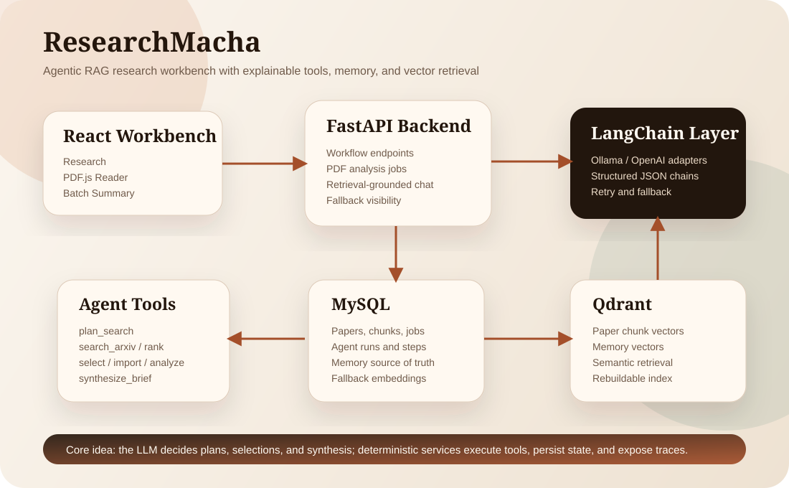
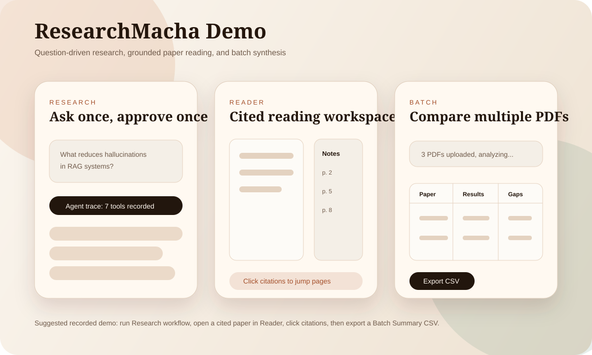

# Demo Walkthrough

Use this walkthrough for a portfolio recording or live demo.

## Visual Assets

Architecture:



Workflow storyboard:



These SVGs are intentionally checked into the repo so the README and docs render well on GitHub without external tooling. After full manual testing, add real screenshots or a GIF under `docs/assets/` and link them from the README.

Recommended filenames for captured media:

- `docs/assets/research-workflow.gif`
- `docs/assets/reader-citation-jump.png`
- `docs/assets/batch-summary-export.png`

## Seed Demo Project

The backend includes a small seed script for creating a demo research project with known arXiv candidates.

Run from the API directory:

```powershell
cd api
.\.venv\Scripts\python.exe scripts\seed_demo.py
```

This script creates the demo project used by the debug project routes. It does not import and analyze every paper automatically; the main showcase path should still be the visible `Research` workflow.

## Recording Script

1. Start MySQL, Qdrant, backend, and frontend.
2. Open `Research`.
3. Ask:

   ```text
   What are effective methods for reducing hallucinations in retrieval augmented generation systems?
   ```

4. Show the status track and agent trace.
5. Approve the selected papers.
6. Show imported paper statuses, memory signals, and the final cited brief.
7. Open one imported paper in `Reader`.
8. Show PDF.js page navigation and zoom.
9. Click a note/highlight citation and show the PDF jumping to that page.
10. Ask a grounded chat question:

    ```text
    What should I pay attention to in the experiments?
    ```

11. Open `Batch Summary`.
12. Upload two or three PDFs.
13. Show the comparison table and export CSV.

## What To Emphasize

- The user only supplies a research question and approves papers.
- Agent tools are persisted and visible.
- RAG answers and synthesis are citation-grounded.
- Qdrant is the default vector store, but MySQL fallback keeps the app resilient.
- Memory is simple, inspectable, and improves future selection/synthesis after repeated use.
- The PDF reader supports practical reading behavior: page navigation, zoom, and citation jumps.
